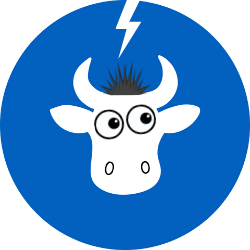

# 🐮 CowGnition

CowGnition connects Remember The Milk to Claude Desktop, allowing you to manage your tasks using natural language with Claude.



## Features

- 🚀 Easy setup with guided process
- 🔄 Seamless integration with Claude Desktop
- 🔑 Secure authentication with Remember The Milk
- 💬 Natural language task management
- 📱 Works across platforms (macOS, Windows, Linux)

## Installation

### Homebrew (macOS/Linux)

```bash
brew install dkoosis/tap/cowgnition
```

Manual Installation

Download the latest release from GitHub Releases
Extract and install:

bash# For macOS/Linux
tar -xzf cowgnition-\*.tar.gz
sudo mv cowgnition /usr/local/bin/

# For Windows

# Extract the ZIP file and add the directory to your PATH

Building from Source
bashgit clone https://github.com/dkoosis/cowgnition.git
cd cowgnition
make
sudo make install
Setup
Run the setup wizard to configure CowGnition:
bashcowgnition setup
The setup wizard will:

Guide you through obtaining Remember The Milk API credentials
Create a configuration file
Configure Claude Desktop integration

Usage
Starting the Server
bashcowgnition serve
This will start the CowGnition server that communicates with Claude Desktop.
Using with Claude Desktop
Once CowGnition is set up and running, open Claude Desktop and try asking:

"What tasks are due today?"
"Create a new task to buy milk tomorrow"
"What's on my shopping list?"
"Mark my 'pay bills' task as complete"

Testing Connections
To verify connections to Remember The Milk and Claude Desktop:
bashcowgnition test
Configuration
Configuration is stored in ~/.config/cowgnition/cowgnition.yaml.
You can also use environment variables for sensitive information:

RTM_API_KEY - Your Remember The Milk API key
RTM_SHARED_SECRET - Your Remember The Milk shared secret

FAQ
How do I get Remember The Milk API credentials?

Go to RTM API Keys
Sign in and request an API key
Use the provided API key and shared secret during setup

Does CowGnition store my RTM password?
No, CowGnition uses OAuth authentication and never sees or stores your RTM password.
Contributing
Contributions are welcome! See CONTRIBUTING.md for details.
License
MIT License - See LICENSE for details.
